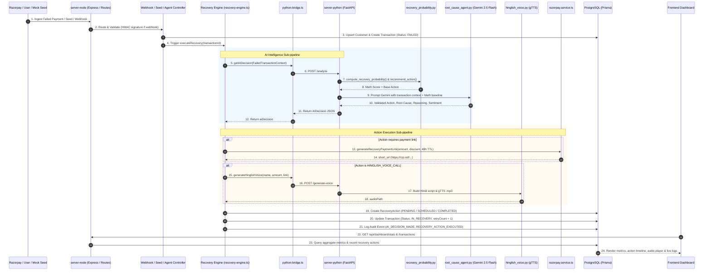

# Revenue Recovery System: File-by-File Server Architecture & Data Flow Guide

This document provides a comprehensive, file-by-file technical breakdown of how the Revenue Recovery backend works across both servers (**Node.js Orchestrator** on port 4000 and **Python AI Microservice** on port 8000).

---

## Table of Contents
1. [High-Level Architectural Topology](#1-high-level-architectural-topology)
2. [End-to-End System Flow Diagram](#2-end-to-end-system-flow-diagram)
3. [How Data Enters the System (Ingestion)](#3-how-data-enters-the-system-ingestion)
4. [File-by-File Explanation: `server-node`](#4-file-by-file-explanation-server-node)
   - [Core & Entrypoints](#core--entrypoints)
   - [Routes Layer (`src/routes/`)](#routes-layer-srcroutes)
   - [Controllers Layer (`src/controllers/`)](#controllers-layer-srccontrollers)
   - [Services & Business Logic (`src/services/`)](#services--business-logic-srcservices)
   - [Background Cron Jobs (`src/jobs/`)](#background-cron-jobs-srcjobs)
   - [Database Schema (`prisma/schema.prisma`)](#database-schema-prismaschemaprisma)
5. [File-by-File Explanation: `server-python`](#5-file-by-file-explanation-server-python)
   - [Core & Entrypoint (`main.py`)](#core--entrypoint-mainpy)
   - [API Routes Layer (`routes/`)](#api-routes-layer-routes)
   - [Statistical & Decision Model (`models/recovery_probability.py`)](#statistical--decision-model-modelsrecovery_probabilitypy)
   - [AI Agents & Synthesis (`agents/`)](#ai-agents--synthesis-agents)
6. [Data Lifecycle & Where Results Go](#6-data-lifecycle--where-results-go)
7. [The Stopping Rules (Safety & Compliance)](#7-the-stopping-rules-safety--compliance)
8. [Quick Reference: Input -> Process -> Output Matrix](#8-quick-reference-input---process---output-matrix)

---

## 1. High-Level Architectural Topology

The system uses a **decoupled, two-tier server architecture**:

```
 ┌────────────────────────────────────────────────────────┐
 │                    CLIENT (React / Vite)              │
 └──────────────┬─────────────────────────▲───────────────┘
                │ HTTP Requests            │ Dashboard Data & Audio
                ▼                          │
 ┌────────────────────────────────────────────────────────┐
 │            SERVER-NODE (Port 4000 - Express & Prisma)  │
 │  - Webhook Ingestion & Cryptographic Verification       │
 │  - Recovery Engine Orchestration                       │
 │  - Razorpay Payment Link Generation & Order Handling   │
 │  - Scheduled Cron Jobs (Hourly, Daily, Escalations)   │
 │  - PostgreSQL Persistence via Supabase Prisma Pooler   │
 └──────────────┬─────────────────────────▲───────────────┘
                │ POST /analyze, /voice    │ Decision, Probabilities,
                │ POST /extract-promise    │ Root Cause, Audio Path
                ▼                          │
 ┌────────────────────────────────────────────────────────┐
 │            SERVER-PYTHON (Port 8000 - FastAPI)         │
 │  - Stage 1: Mathematical Recovery Probability Model    │
 │  - Stage 2: Google Gemini 2.5 Flash Root-Cause Agent   │
 │  - Stage 3: Hinglish Text-to-Speech (gTTS) Audio Engine│
 │  - Stage 4: Natural Language Promise-to-Pay Extractor  │
 └────────────────────────────────────────────────────────┘
```

- **`server-node` (Port 4000)** is the **Orchestrator**. It owns the database, exposes REST endpoints to the client, receives webhooks from payment gateways (Razorpay), enforces stopping rules, creates payment links, and manages audit trails.
- **`server-python` (Port 8000)** is the **Intelligence Layer**. It does not touch the database directly. It receives sanitized transaction context from Node, calculates mathematical probabilities, runs Gemini 2.5 Flash for deep root-cause diagnosis and second-opinion validation, generates personalized Hinglish audio messages, and returns structured JSON back to Node.

---

## 2. End-to-End System Flow Diagram



---

## 3. How Data Enters the System (Ingestion)

Data enters the backend through **five distinct mechanisms**:

1. **Razorpay Webhooks (`POST /api/webhooks/razorpay`)**:
   - **File**: `server-node/src/controllers/webhook.controller.ts`
   - Real-world production entrypoint. Razorpay notifies our server when an event happens:
     - `payment.failed`: An attempted charge was declined by the bank, network dropped, or OTP timed out.
     - `payment.captured` or `payment_link.paid`: A customer completed the payment (triggers stopping rules).
     - `subscription.charged.failed`: Recurring card/mandate deduction failed.
     - `invoice.expired`: A B2B invoice has exceeded its due date without payment.

2. **Synthetic Data Generator (`POST /api/seed/generate?count=50`)**:
   - **File**: `server-node/src/controllers/seed.controller.ts`
   - Generates realistic Indian customer profiles, B2B companies (Infosys, TCS, etc.), authentic failure reasons (`GATEWAY_ERROR`, `INSUFFICIENT_FUNDS`, `CHECKOUT_ABANDONED`, `INVOICE_EXPIRED`), overdue invoices, and cart items.
   - Uses optimized bulk inserts (`prisma.customer.createMany` and `prisma.transaction.createMany`).

3. **Interactive Checkout & Verification (`POST /api/payment/create-order` & `verify`)**:
   - **File**: `server-node/src/controllers/payment.controller.ts`
   - Used by the frontend demo checkout modal. Creates an active Razorpay order (`orders.create`), receives payment authorization credentials (`razorpay_payment_id`, `razorpay_order_id`, `razorpay_signature`), verifies the cryptographic HMAC signature, and marks the transaction as `RECOVERED`.

4. **Batch AI Execution Trigger (`POST /api/agent/run-batch`)**:
   - **File**: `server-node/src/controllers/agent.controller.ts`
   - Triggered manually from the dashboard's "Run AI Recovery Batch" button. Fetches all unrecovered transactions with fewer than 3 retries and passes each through the recovery engine.

5. **Automated Background Cron Sequencer**:
   - **File**: `server-node/src/jobs/retry-sequencer.ts`
   - Scheduled tasks that awake automatically:
     - Every hour: executes scheduled future retry links and overdue promise-to-pay commitments.
     - Every day at 9:00 AM (Day 1–3 of the month): retries failed recurring mandates when salary accounts are credited.

---

## 4. File-by-File Explanation: `server-node`

### Core & Entrypoints

#### [`server-node/src/index.ts`](file:///e:/CodeWork/PROJECT-PLAYGROUND/Revenue%20Recovery/server-node/src/index.ts)
- **Role**: Express application bootstrapper.
- **How it handles data**:
  - Sets up `express.raw({ type: 'application/json' })` specifically for `/api/webhooks`. This is mandatory so Razorpay's cryptographic HMAC SHA-256 signature can be checked against the exact raw byte string before any parsing alters whitespace.
  - Mounts standard `express.json()` for all other API routes.
  - Enables CORS for `http://localhost:5173` (the Vite client).
  - Mounts the 5 top-level routers: `/api/webhooks`, `/api/agent`, `/api/dashboard`, `/api/seed`, `/api/payment`.
  - Exposes `GET /health` to confirm server status.
  - Calls `startCronJobs()` upon HTTP server listening on port 4000.

---

### Routes Layer (`src/routes/`)

Each file binds clean REST URIs to corresponding controller functions:

1. **[`server-node/src/routes/webhook.routes.ts`](file:///e:/CodeWork/PROJECT-PLAYGROUND/Revenue%20Recovery/server-node/src/routes/webhook.routes.ts)**:
   - `POST /` $\rightarrow$ calls `handleRazorpayWebhook`.
2. **[`server-node/src/routes/agent.routes.ts`](file:///e:/CodeWork/PROJECT-PLAYGROUND/Revenue%20Recovery/server-node/src/routes/agent.routes.ts)**:
   - `POST /run-batch` $\rightarrow$ calls `runBatch` (runs AI on all failed transactions).
   - `GET /batches` $\rightarrow$ calls `getBatches` (returns history of batch recoveries).
3. **[`server-node/src/routes/dashboard.routes.ts`](file:///e:/CodeWork/PROJECT-PLAYGROUND/Revenue%20Recovery/server-node/src/routes/dashboard.routes.ts)**:
   - `GET /stats` $\rightarrow$ aggregate KPI metrics.
   - `GET /transactions` $\rightarrow$ paginated transaction table with filters.
   - `GET /transactions/:id` $\rightarrow$ detailed view of a single transaction.
   - `GET /audit-logs` $\rightarrow$ audit trail events.
4. **[`server-node/src/routes/seed.routes.ts`](file:///e:/CodeWork/PROJECT-PLAYGROUND/Revenue%20Recovery/server-node/src/routes/seed.routes.ts)**:
   - `POST /generate` $\rightarrow$ calls `generateMockData`.
5. **[`server-node/src/routes/payment.routes.ts`](file:///e:/CodeWork/PROJECT-PLAYGROUND/Revenue%20Recovery/server-node/src/routes/payment.routes.ts)**:
   - `POST /create-order` $\rightarrow$ creates Razorpay checkout order.
   - `POST /verify` $\rightarrow$ verifies checkout signature and marks recovered.

---

### Controllers Layer (`src/controllers/`)

#### [`server-node/src/controllers/webhook.controller.ts`](file:///e:/CodeWork/PROJECT-PLAYGROUND/Revenue%20Recovery/server-node/src/controllers/webhook.controller.ts)
- **Role**: Razorpay webhook ingestion and lifecycle router.
- **Step-by-step logic**:
  1. `handleRazorpayWebhook()` reads `x-razorpay-signature` header and validates it using `verifyWebhookSignature(rawBody, signature, secret)`.
  2. If signature fails, logs `WEBHOOK_SIGNATURE_INVALID` and rejects with HTTP 400.
  3. If valid, immediately sends `200 { received: true }` back to Razorpay to prevent webhook delivery timeouts (Razorpay drops webhooks that do not respond within 5 seconds).
  4. Wraps further execution in `setImmediate()` to process asynchronously in Node's event loop:
     - `payment.failed`: Calls `handlePaymentFailed()`. Creates or finds the `Customer`, records a new `Transaction` with status `FAILED`, records an `AuditLog`, and immediately invokes `executeRecovery(transaction.id)`.
     - `payment.captured` / `payment_link.paid`: Calls `handlePaymentSucceeded()`. **CRITICAL STOPPING RULE**: Finds the transaction by Razorpay Payment ID or Order ID, sets `status = 'RECOVERED'`, and marks all pending/scheduled recovery actions as `CANCELLED` with reason `"Payment received — stopping recovery"`.
     - `subscription.charged.failed`: Calls `handleSubscriptionFailed()`, records failure type `SUBSCRIPTION_FAILED`, and invokes `executeRecovery()`.
     - `invoice.expired`: Calls `handleInvoiceExpired()`, sets customer type to `B2B`, sets `invoiceDueDate`, and invokes `executeRecovery()`.

#### [`server-node/src/controllers/seed.controller.ts`](file:///e:/CodeWork/PROJECT-PLAYGROUND/Revenue%20Recovery/server-node/src/controllers/seed.controller.ts)
- **Role**: High-performance mock data seeder.
- **Step-by-step logic**:
  1. Purges existing demo data (`AuditLog`, `RecoveryAction`, `Transaction`, `Customer`, `RecoveryBatch`).
  2. Synthesizes `count` (default 50) realistic records spanning:
     - 80% B2C consumers (Indian names, phone numbers, retail carts, ₹99–₹9,999).
     - 20% B2B corporate procurement (Infosys, TCS, Wipro, invoices ₹5,000–₹5,00,000).
     - Diverse error scenarios (`BAD_REQUEST_ERROR`, `GATEWAY_ERROR`, `SERVER_ERROR`, `INSUFFICIENT_FUNDS`, `CARD_EXPIRED`, `CHECKOUT_ABANDONED`, `SUBSCRIPTION_CHARGE_FAILED`, `INVOICE_EXPIRED`, `MANDATE_DEBIT_FAILED`).
  3. Executes two bulk batch inserts: `prisma.customer.createMany` followed by `prisma.transaction.createMany`.
  4. Returns scenario count breakdown to the client.

#### [`server-node/src/controllers/dashboard.controller.ts`](file:///e:/CodeWork/PROJECT-PLAYGROUND/Revenue%20Recovery/server-node/src/controllers/dashboard.controller.ts)
- **Role**: Data aggregation engine feeding the frontend dashboard.
- **Endpoints**:
  - `getStats`: Runs parallel queries using `prisma.transaction.aggregate` and `groupBy`:
    - `totalAtRisk`: Sum of all failed amounts.
    - `totalRecovered`: Sum of recovered amounts.
    - `recoveryRate`: $\frac{\text{totalRecovered}}{\text{totalAtRisk}} \times 100$.
    - `statusBreakdown`: Count and volume grouped by `FAILED`, `IN_RECOVERY`, `RECOVERED`, `ABANDONED`.
    - `failureTypeBreakdown`: Grouped by `PAYMENT_FAILED`, `CHECKOUT_ABANDONED`, etc.
    - `recentRecoveries`: Last 10 successful recoveries with customer details.
  - `getTransactions`: Paginated transaction list (page, limit, status, failureType filter) including customer details and the latest AI recovery action.
  - `getTransactionDetail`: Returns a single transaction by ID, including its full customer relation, all historical `recoveryActions` sorted chronologically, and complete `auditLogs`.
  - `getAuditLogs`: Returns paginated immutable system logs.

#### [`server-node/src/controllers/agent.controller.ts`](file:///e:/CodeWork/PROJECT-PLAYGROUND/Revenue%20Recovery/server-node/src/controllers/agent.controller.ts)
- **Role**: Batch execution controller.
- **Endpoints**:
  - `runBatch`: Invokes `runBatchRecovery()` from `recovery-engine.ts`.
  - `getBatches`: Fetches past `RecoveryBatch` records, joins transactions that were recovered within the batch timeframe, and computes the actual money recovered per batch.

#### [`server-node/src/controllers/payment.controller.ts`](file:///e:/CodeWork/PROJECT-PLAYGROUND/Revenue%20Recovery/server-node/src/controllers/payment.controller.ts)
- **Role**: Live simulation checkout handler.
- **Endpoints**:
  - `createOrder`: Calls `razorpay.orders.create({ amount, currency: 'INR', receipt })` and returns `order_id`.
  - `verifyPayment`: Computes HMAC SHA-256 of `${razorpay_order_id}|${razorpay_payment_id}` using `RAZORPAY_KEY_SECRET`. If matching, sets the transaction's status to `RECOVERED` and writes an audit log.

---

### Services & Business Logic (`src/services/`)

#### [`server-node/src/services/recovery-engine.ts`](file:///e:/CodeWork/PROJECT-PLAYGROUND/Revenue%20Recovery/server-node/src/services/recovery-engine.ts)
- **Role**: **The Central Nervous System** of the recovery pipeline.
- **Functions**:
  - `executeRecovery(transactionId: string)`:
    1. **Pre-flight Stopping Rules**:
       - If `transaction.status === 'RECOVERED'`, abort.
       - If `transaction.retryCount >= 3`, mark `transaction.status = 'ABANDONED'` and abort.
    2. **Call Intelligence**: Calls `getAIDecision()` in `python-bridge.ts` passing customer type, amount, error codes, cart items, retry count, etc.
    3. **Evaluate AI Decision**:
       - If `action === 'NO_ACTION'`: Records `RecoveryAction` with status `COMPLETED` and halts (e.g. fraud protection).
       - If action requires a payment link (e.g. `IMMEDIATE_RETRY_LINK`, `DISCOUNT_OFFER`, `DELAYED_RETRY_LINK`, `HINGLISH_VOICE_CALL`):
         - Applies discount percentage if recommended (e.g. 10% off).
         - Calls `generateRecoveryPaymentLink()` in `razorpay.service.ts` with 48-hour auto-expiry.
       - If `action === 'HINGLISH_VOICE_CALL'`:
         - Calls `generateHinglishVoice()` in `python-bridge.ts`.
         - Saves returned `.mp3` path to `voiceAudioPath`.
    4. **Persist Action**:
       - Creates a `RecoveryAction` record in Prisma with `aiRootCause`, `aiReasoning`, `aiConfidence`, `recoveryProb`, `paymentLinkUrl`, `voiceAudioPath`, and `scheduledFor` (if delayed).
    5. **Update Transaction State**:
       - Updates `Transaction`: `status = 'IN_RECOVERY'`, `retryCount = retryCount + 1`.
    6. **Audit**:
       - Writes `RECOVERY_ACTION_EXECUTED` log to `AuditLog`.
  - `runBatchRecovery()`:
    1. Queries all `Transaction` rows where `status == 'FAILED'` and `retryCount < 3`.
    2. Creates a `RecoveryBatch` entry with `totalAtRisk = sum(amount)`.
    3. Loops through each transaction, calling `executeRecovery(txn.id)` with a small throttle delay (500ms) to respect rate limits.
    4. Marks batch `COMPLETED` and returns count and amount at risk.

#### [`server-node/src/services/python-bridge.ts`](file:///e:/CodeWork/PROJECT-PLAYGROUND/Revenue%20Recovery/server-node/src/services/python-bridge.ts)
- **Role**: HTTP client adapter to the Python AI microservice (`http://localhost:8000`).
- **Methods**:
  - `getAIDecision(context: FailedTransactionContext)`: Calls `POST /analyze`. If Python is offline, gracefully degrades to a deterministic fallback (`action: 'IMMEDIATE_RETRY_LINK'`, `confidence: 0.5`).
  - `extractPromiseToPay(customerMessage: string)`: Calls `POST /extract-promise`.
  - `generateHinglishVoice(customerName, amount, paymentLink)`: Calls `POST /generate-voice`.

#### [`server-node/src/services/razorpay.service.ts`](file:///e:/CodeWork/PROJECT-PLAYGROUND/Revenue%20Recovery/server-node/src/services/razorpay.service.ts)
- **Role**: Razorpay SDK wrapper.
- **Methods**:
  - `generateRecoveryPaymentLink(opts)`: Calls `razorpay.paymentLink.create()` with amount in paise, notification flags (SMS/Email), reminder enablements, 48-hour expiry timestamp, and `reference_id` pointing to our internal Transaction ID. (Has fallback mock mode if keys are unset).
  - `verifyWebhookSignature(body, signature, secret)`: Computes `crypto.createHmac('sha256', secret).update(body).digest('hex')` and validates against the received signature.

#### [`server-node/src/services/audit.service.ts`](file:///e:/CodeWork/PROJECT-PLAYGROUND/Revenue%20Recovery/server-node/src/services/audit.service.ts)
- **Role**: Tamper-proof audit logger.
- **Method**:
  - `log(event, actor, details, transactionId?)`: Writes an immutable row into the `AuditLog` table. Wrapped in `try/catch` so logging never interrupts critical recovery flows.

#### [`server-node/src/services/db.ts`](file:///e:/CodeWork/PROJECT-PLAYGROUND/Revenue%20Recovery/server-node/src/services/db.ts)
- **Role**: Prisma Client singleton. Reuses existing client instances in development to avoid exhausting database connection pools on hot reloads.

---

### Background Cron Jobs (`src/jobs/`)

#### [`server-node/src/jobs/retry-sequencer.ts`](file:///e:/CodeWork/PROJECT-PLAYGROUND/Revenue%20Recovery/server-node/src/jobs/retry-sequencer.ts)
- **Role**: Asynchronous schedulers and escalation sequences.
- **Schedules**:
  1. `0 * * * *` (Hourly):
     - `checkScheduledActions()`: Finds `RecoveryAction` where `status = 'SCHEDULED'` and `scheduledFor <= now()`. Executes the recovery action.
     - `checkPromiseToPay()`: Finds `Transaction` where `status = 'PROMISE_TO_PAY'` and `promisedPayDate <= now()`. Automatically triggers a follow-up recovery action.
     - `checkB2BEscalation()`: Escalates B2B unpaid invoices based on days elapsed:
       - Attempt 0: Polite reminder email.
       - Attempt 1 (after 2 days): Firm payment notice.
       - Attempt 2 (after 4 days): Escalation to CFO / senior leadership.
  2. `0 9 * * *` (Daily at 9:00 AM):
     - `retryMandates()`: Checks if current day is between the 1st and 3rd of the month (salary credit window in India). Automatically retries failed recurring auto-debit mandates.

---

### Database Schema (`prisma/schema.prisma`)

- **Entities**:
  - `Customer`: Contains contact details, `CustomerType` (`B2C` or `B2B`), and company name.
  - `Transaction`: Tracks payment amount, currency, status (`FAILED`, `IN_RECOVERY`, `RECOVERED`, `ABANDONED`, `PROMISE_TO_PAY`), failure type, error codes, retry count, cart items, due dates, and recovered amounts.
  - `RecoveryAction`: Records each AI decision (`actionType`, `aiRootCause`, `aiReasoning`, `aiConfidence`, `recoveryProb`), execution assets (`paymentLinkUrl`, `voiceAudioPath`), timestamps, and cancellation state (`cancelledAt`, `cancelReason`).
  - `AuditLog`: Immutable trail containing event, actor (`RAZORPAY_WEBHOOK`, `AI_AGENT`, `CRON_JOB`, `USER`, `SYSTEM`), details JSON, and timestamp.
  - `RecoveryBatch`: Tracks batch operations, money at risk, and money recovered.

---

## 5. File-by-File Explanation: `server-python`

### Core & Entrypoint (`main.py`)

#### [`server-python/main.py`](file:///e:/CodeWork/PROJECT-PLAYGROUND/Revenue%20Recovery/server-python/main.py)
- **Role**: FastAPI microservice entrypoint.
- **How it handles data**:
  - Loads `.env` file containing `GEMINI_API_KEY`.
  - Configures CORS for `http://localhost:4000` (Node server) and `http://localhost:5173` (Frontend).
  - Mounts 3 route modules:
    - `analyze_router` (Recovery decisions).
    - `voice_router` (Hinglish audio generation & audio file serving).
    - `promise_router` (Natural language promise-to-pay extraction).
  - Exposes `GET /health` endpoint.

---

### API Routes Layer (`routes/`)

#### [`server-python/routes/analyze.py`](file:///e:/CodeWork/PROJECT-PLAYGROUND/Revenue%20Recovery/server-python/routes/analyze.py)
- **Role**: Core AI decision endpoint (`POST /analyze`).
- **Input**: `TransactionContext` (Pydantic model validating `transactionId`, `amount`, `failureType`, `errorCode`, `retryCount`, `cartItems`, `customerType`, etc.).
- **Two-Stage Processing Pipeline**:
  1. **Stage 1 (Mathematical Scoring)**:
     - Calls `compute_recovery_probability()` from `models/recovery_probability.py`.
     - Calls `recommend_action()` to determine base mathematical strategy, discount eligibility, and scheduled delays.
  2. **Stage 2 (Gemini LLM Enrichment & Validation)**:
     - Calls `analyze_transaction()` from `agents/root_cause_agent.py`, passing transaction context, math probability, and recommended baseline action.
     - Receives deep natural-language root cause diagnosis, sentiment detection, and action validation.
  3. **Output**: `AIDecisionResponse` containing:
     - `action`: Validated recovery action string.
     - `rootCause`: Plain-English explanation of why the payment failed.
     - `reasoning`: Strategic justification for the chosen channel/incentive.
     - `confidence`: Confidence score (0.0 to 1.0).
     - `recoveryProbability`: Calculated mathematical probability.
     - `scheduledDelay`: Recommended delay in minutes.
     - `discountPercent`: Discount percentage (e.g. 5% or 10%).
     - `hinglishMessage`: Hinglish text if voice call is recommended.
     - `customerSentiment`: Detected sentiment (`FRUSTRATED`, `WILLING`, `UNAWARE`, etc.).

#### [`server-python/routes/voice.py`](file:///e:/CodeWork/PROJECT-PLAYGROUND/Revenue%20Recovery/server-python/routes/voice.py)
- **Role**: Voice generation and streaming.
- **Endpoints**:
  - `POST /generate-voice`: Accepts customer name, amount, and payment link. Calls `generate_hinglish_audio()` in `hinglish_voice.py` and returns the generated `.mp3` path.
  - `GET /audio/{filename}`: Streams the generated `.mp3` file from `audio_files/` with `media_type="audio/mpeg"`, allowing direct playback inside the React dashboard.

#### [`server-python/routes/promise.py`](file:///e:/CodeWork/PROJECT-PLAYGROUND/Revenue%20Recovery/server-python/routes/promise.py)
- **Role**: Promise-to-pay NLP parser (`POST /extract-promise`).
- **Input**: `{ "message": "I'm travelling right now, will pay by Friday" }`.
- **Output**: `{ "promisedDate": "2026-09-25", "confidence": 0.9, "rawMention": "by Friday" }`.

---

### Statistical & Decision Model (`models/recovery_probability.py`)

#### [`server-python/models/recovery_probability.py`](file:///e:/CodeWork/PROJECT-PLAYGROUND/Revenue%20Recovery/server-python/models/recovery_probability.py)
- **Role**: Transparent, auditable mathematical scoring model for financial decisions.
- **Functions**:
  - `compute_recovery_probability(...)`:
    Calculates $P(\text{recovery}) \in [0.0, 1.0]$ using 5 weighted domain features:
    1. **Base Error Severity Weight**:
       - `GATEWAY_ERROR`: 0.85 (network glitch; high intent).
       - `SUBSCRIPTION_CHARGE_FAILED`: 0.70.
       - `CHECKOUT_ABANDONED`: 0.65.
       - `INSUFFICIENT_FUNDS`: 0.40.
       - `SUSPECTED_FRAUD`: 0.05.
    2. **Amount Factor**:
       - Sweet spot (₹500 – ₹50,000): multiplier 1.0.
       - Small amounts (< ₹100): multiplier 0.70.
       - Large enterprise (> ₹50,000): multiplier 0.95.
    3. **Retry Count Decay**:
       - $\max(0.30, 1.0 - (\text{retryCount} \times 0.25))$.
    4. **Time Sensitivity Factor**:
       - For checkout abandonment: < 30 mins = 1.0; 30–120 mins = 0.75; > 2 hours = 0.45.
    5. **Customer Type Multiplier**:
       - B2B multiplier = 1.1 (contractual obligations increase eventual collection).
  - `recommend_action(...)`:
    Deterministic, bounded decision rules:
    - If $P < 0.10$ or `SUSPECTED_FRAUD` $\rightarrow$ `NO_ACTION`.
    - If Amount > ₹50,000 and $P > 0.60$ $\rightarrow$ `HINGLISH_VOICE_CALL` (high-touch personalized outreach).
    - If B2B `INVOICE_OVERDUE` $\rightarrow$ `B2B_REMINDER_EMAIL` (attempt 0), `B2B_FIRM_EMAIL` (attempt 1), `B2B_ESCALATION_EMAIL` (attempt 2).
    - If `GATEWAY_ERROR` / `SERVER_ERROR` $\rightarrow$ `IMMEDIATE_RETRY_LINK` (immediate re-attempt).
    - If `INSUFFICIENT_FUNDS` with Amount > ₹2,000 $\rightarrow$ `DISCOUNT_OFFER` (10% discount after 2-hour delay).
    - If `CHECKOUT_ABANDONED` $\rightarrow$ `IMMEDIATE_RETRY_LINK` (5% discount if cart > ₹1,000).

---

### AI Agents & Synthesis (`agents/`)

#### [`server-python/agents/root_cause_agent.py`](file:///e:/CodeWork/PROJECT-PLAYGROUND/Revenue%20Recovery/server-python/agents/root_cause_agent.py)
- **Role**: Gemini 2.5 Flash cognitive layer.
- **Model**: `genai.GenerativeModel("gemini-2.5-flash")`.
- **Functions**:
  - `analyze_transaction(transaction_context, math_model_action, recovery_probability)`:
    - Injects a strict system prompt constraining outputs to valid JSON conforming to the allowed action types.
    - Diagnoses root cause in plain English (e.g., *"Customer experienced an issuing bank timeout during 3D Secure verification"*).
    - Evaluates customer sentiment and urgency.
    - Validates or refines the mathematical recommendation.
    - Includes fallback handling if Gemini API quota or network errors occur.
  - `extract_promise_to_pay(customer_message)`:
    - Resolves relative time phrases ("tomorrow", "coming Monday", "end of month") against today's date into an explicit ISO `YYYY-MM-DD` date.

#### [`server-python/agents/hinglish_voice.py`](file:///e:/CodeWork/PROJECT-PLAYGROUND/Revenue%20Recovery/server-python/agents/hinglish_voice.py)
- **Role**: Cultural adaptation and localized audio generation.
- **Functions**:
  - `build_hinglish_script(customer_name, amount, payment_link)`:
    Generates a natural, respectful Hinglish script:
    > *"Namaste, [Name] ji! Aapka [Amount] rupaye ka payment unfortunately process nahi ho saka. Koi tension nahi — hum aapki help karne ke liye yahan hain. Aapke liye ek naya payment link ready hai. Kripya apna SMS ya email check karein aur payment complete karein. Dhanyavaad!"*
  - `generate_hinglish_audio(...)`:
    Uses `gTTS` with Hindi phonetics (`lang="hi"`), writes the resulting `.mp3` to `server-python/audio_files/`, and returns the absolute filepath.

---

## 6. Data Lifecycle & Where Results Go

### 1. Database Storage (PostgreSQL via Prisma)
Every step of the recovery process is recorded across four database tables:
- **`Transaction`**:
  - Status transitions: `FAILED` $\rightarrow$ `IN_RECOVERY` $\rightarrow$ `RECOVERED` (or `ABANDONED` if max retries exceeded).
  - Stores `retryCount`, `recoveredAmount`, and `recoveredAt`.
- **`RecoveryAction`**:
  - Records the exact action taken, timestamp, `aiRootCause`, `aiReasoning`, `aiConfidence`, `recoveryProb`, `paymentLinkUrl`, `paymentLinkId`, and `voiceAudioPath`.
  - If payment succeeds later, status becomes `CANCELLED` with `cancelReason`.
- **`AuditLog`**:
  - Immutable historical record of events: `SEED_COMPLETED`, `WEBHOOK_RECEIVED`, `AI_DECISION_MADE`, `PAYMENT_LINK_GENERATED`, `RECOVERY_ACTION_EXECUTED`, `PAYMENT_RECOVERED`.
- **`RecoveryBatch`**:
  - Tracks total money at risk vs recovered for hackathon ROI benchmarking.

### 2. File Assets Storage
- Audio files generated by the Hinglish voice agent are stored in `server-python/audio_files/recovery_[hash].mp3`.
- Served over HTTP via `GET /audio/{filename}` in `server-python/routes/voice.py`.

### 3. Frontend Result Retrieval (`client/src/api.ts`)
The client fetches and displays recovery results via the following API endpoints:
- `api.getStats()` $\rightarrow$ Renders KPI cards: Total at Risk, Total Recovered, Recovery Rate %, and Recent Recoveries list.
- `api.getTransactions()` $\rightarrow$ Renders the main recovery table with badges, AI diagnosis, recovery probability, and payment link actions.
- `api.getTransactionDetail(id)` $\rightarrow$ Renders the side-drawer showing timeline of actions, AI reasoning, and playable Hinglish audio recordings.
- `api.getAuditLogs()` $\rightarrow$ Renders the real-time compliance audit stream.
- `api.getBatches()` $\rightarrow$ Renders historical batch recovery runs and measured ROI.

---

## 7. The Stopping Rules (Safety & Compliance)

A crucial aspect of enterprise revenue recovery is **knowing when NOT to message a customer**. The system implements four strict stopping rules:

1. **Immediate Success Cancellation (Stopping Rule #1)**:
   - In [`webhook.controller.ts:145-156`](file:///e:/CodeWork/PROJECT-PLAYGROUND/Revenue%20Recovery/server-node/src/controllers/webhook.controller.ts#L145-L156): When Razorpay fires `payment.captured` or `payment_link.paid`, the system queries all `PENDING` and `SCHEDULED` actions for that transaction and updates them to `CANCELLED` with reason `"Payment received — stopping recovery"`. No further emails, calls, or retries will be dispatched.
2. **Maximum 3 Retry Threshold (Stopping Rule #2)**:
   - In [`recovery-engine.ts:32-40`](file:///e:/CodeWork/PROJECT-PLAYGROUND/Revenue%20Recovery/server-node/src/services/recovery-engine.ts#L32-L40): If `transaction.retryCount >= 3`, recovery is immediately halted, status is set to `ABANDONED`, and `MAX_RETRIES_REACHED` is logged.
3. **Fraud & Risk Suppression (Stopping Rule #3)**:
   - In [`recovery_probability.py:121-127`](file:///e:/CodeWork/PROJECT-PLAYGROUND/Revenue%20Recovery/server-python/models/recovery_probability.py#L121-L127) and [`root_cause_agent.py:47`](file:///e:/CodeWork/PROJECT-PLAYGROUND/Revenue%20Recovery/server-python/agents/root_cause_agent.py#L47): Transactions with error code `SUSPECTED_FRAUD` or recovery probability $< 0.10$ are assigned `NO_ACTION`. No outreach is attempted.
4. **Time-To-Live Link Expiry (Stopping Rule #4)**:
   - In [`razorpay.service.ts:61`](file:///e:/CodeWork/PROJECT-PLAYGROUND/Revenue%20Recovery/server-node/src/services/razorpay.service.ts#L61): Every payment link is generated with an explicit 48-hour expiration (`expire_by: Date.now() + 48 hours`). Expired links cannot be paid, preventing stale transactions from executing months later.

---

## 8. Quick Reference: Input -> Process -> Output Matrix

| Step / Goal | File(s) Handling Input | File(s) Processing / Logic | File(s) Storing / Returning Results | Output / Result |
| :--- | :--- | :--- | :--- | :--- |
| **Ingest Failed Payment** | `server-node/src/controllers/webhook.controller.ts` | `webhook.controller.ts`, `razorpay.service.ts` | `prisma/schema.prisma` (`Transaction`, `Customer`) | New `Transaction` record created with status `FAILED` |
| **Generate Demo Seed Data** | `server-node/src/controllers/seed.controller.ts` | `seed.controller.ts` | `prisma/schema.prisma` | 50 diverse failed transactions inserted into Supabase DB |
| **Compute Recovery Probability** | `server-node/src/services/python-bridge.ts` | `server-python/models/recovery_probability.py` | `server-python/routes/analyze.py` | Float $P(\text{recovery}) \in [0.0, 1.0]$ and recommended base action |
| **Diagnose Root Cause & Validate** | `server-python/routes/analyze.py` | `server-python/agents/root_cause_agent.py` (Gemini 2.5 Flash) | `server-python/routes/analyze.py` | JSON containing `root_cause`, `reasoning`, `validated_action`, `customer_sentiment` |
| **Generate Payment Link** | `server-node/src/services/recovery-engine.ts` | `server-node/src/services/razorpay.service.ts` | `prisma/schema.prisma` (`RecoveryAction.paymentLinkUrl`) | Active Razorpay link (`https://rzp.io/l/...`) with 48h TTL |
| **Generate Localized Audio** | `server-node/src/services/python-bridge.ts` | `server-python/agents/hinglish_voice.py` (gTTS) | `server-python/audio_files/*.mp3`, `prisma/schema.prisma` (`voiceAudioPath`) | Custom Hinglish speech audio file ready for phone or dashboard playback |
| **Execute & Track Recovery Action** | `server-node/src/services/recovery-engine.ts` | `recovery-engine.ts` | `prisma/schema.prisma` (`RecoveryAction`, `Transaction`, `AuditLog`) | Status updated to `IN_RECOVERY`, `retryCount + 1`, logged to audit trail |
| **Stop Pending Actions on Success** | `server-node/src/controllers/webhook.controller.ts` | `webhook.controller.ts` | `prisma/schema.prisma` (`Transaction.status = RECOVERED`, `RecoveryAction.status = CANCELLED`) | All pending actions cancelled, recovered sum credited |
| **Serve Dashboard KPIs & Tables** | `server-node/src/routes/dashboard.routes.ts` | `server-node/src/controllers/dashboard.controller.ts` | `client/src/api.ts` $\rightarrow$ React UI | Dynamic metrics, charts, transactions list, and audio player |
