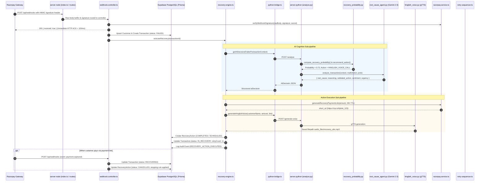

# Revenue Recovery System: File-by-File Server Architecture & Data Flow Guide

This document is an exhaustive, technical deep-dive into the Revenue Recovery backend. It covers both servers (**Node.js Orchestrator** on port 4000 and **Python AI Microservice** on port 8000), tracing a concrete failed payment payload through every single file, explaining what each section and line of code does, why it exists, and how the data mutates across the lifecycle.

---

## Table of Contents

1. [Two-Tier Architectural Paradigm](#1-two-tier-architectural-paradigm)
2. [End-to-End Sequence Diagram](#2-end-to-end-sequence-diagram)
3. [The Concrete Example Dataset](#3-the-concrete-example-dataset)
4. [Step-by-Step Data Journey Through Every Server File](#4-step-by-step-data-journey-through-every-server-file)
   - [Phase 1: Ingestion & Verification (`server-node`)](#phase-1-ingestion--verification-server-node)
     - [`server-node/src/index.ts`](#server-nodesrcindexts)
     - [`server-node/src/routes/webhook.routes.ts`](#server-nodesrcrouteswebhookroutests)
     - [`server-node/src/services/razorpay.service.ts` (Webhook Verification)](#server-nodesrcservicesrazorpayservicets-webhook-verification)
     - [`server-node/src/controllers/webhook.controller.ts`](#server-nodesrccontrollerswebhookcontrollerts)
     - [`server-node/src/services/db.ts`](#server-nodesrcservicesdbts)
     - [`server-node/prisma/schema.prisma`](#server-nodeprismaschemaprisma)
     - [`server-node/src/services/audit.service.ts`](#server-nodesrcservicesauditservicets)
   - [Phase 2: Orchestration & Python Bridge (`server-node`)](#phase-2-orchestration--python-bridge-server-node)
     - [`server-node/src/services/recovery-engine.ts` (Part 1: Pre-flight & Dispatch)](#server-nodesrcservicesrecovery-enginets-part-1)
     - [`server-node/src/services/python-bridge.ts`](#server-nodesrcservicespython-bridgets)
   - [Phase 3: Cognitive Intelligence & Probability (`server-python`)](#phase-3-cognitive-intelligence--probability-server-python)
     - [`server-python/main.py`](#server-pythonmainpy)
     - [`server-python/routes/analyze.py`](#server-pythonroutesanalyzepy)
     - [`server-python/models/recovery_probability.py`](#server-pythonmodelsrecovery_probabilitypy)
     - [`server-python/agents/root_cause_agent.py`](#server-pythonagentsroot_cause_agentpy)
     - [`server-python/routes/voice.py`](#server-pythonroutesvoicepy)
     - [`server-python/agents/hinglish_voice.py`](#server-pythonagentshinglish_voicepy)
     - [`server-python/routes/promise.py`](#server-pythonroutespromisepy)
   - [Phase 4: Execution & Persistence (`server-node`)](#phase-4-execution--persistence-server-node)
     - [`server-node/src/services/recovery-engine.ts` (Part 2: Link Generation & State Transition)](#server-nodesrcservicesrecovery-enginets-part-2)
     - [`server-node/src/services/razorpay.service.ts` (Payment Link Creation)](#server-nodesrcservicesrazorpayservicets-payment-link-creation)
   - [Phase 5: Background Cron Jobs & Re-engagement (`server-node`)](#phase-5-background-cron-jobs--re-engagement-server-node)
     - [`server-node/src/jobs/retry-sequencer.ts`](#server-nodesrcjobsretry-sequencerts)
   - [Phase 6: Frontend API & Interactive Recovery (`server-node`)](#phase-6-frontend-api--interactive-recovery-server-node)
     - [`server-node/src/routes/dashboard.routes.ts`](#server-nodesrcroutesdashboardroutests)
     - [`server-node/src/controllers/dashboard.controller.ts`](#server-nodesrccontrollersdashboardcontrollerts)
     - [`server-node/src/routes/agent.routes.ts`](#server-nodesrcroutesagentroutests)
     - [`server-node/src/controllers/agent.controller.ts`](#server-nodesrccontrollersagentcontrollerts)
     - [`server-node/src/routes/seed.routes.ts`](#server-nodesrcroutesseedroutests)
     - [`server-node/src/controllers/seed.controller.ts`](#server-nodesrccontrollersseedcontrollerts)
     - [`server-node/src/routes/payment.routes.ts`](#server-nodesrcroutespaymentroutests)
     - [`server-node/src/controllers/payment.controller.ts`](#server-nodesrccontrollerspaymentcontrollerts)
5. [The 4 Enterprise Stopping Rules](#5-the-4-enterprise-stopping-rules)
6. [Master Input -> File -> Output Reference Matrix](#6-master-input---file---output-reference-matrix)

---

## 1. Two-Tier Architectural Paradigm

The system separates **Orchestration & State Management** from **Cognitive Intelligence & Text-to-Speech**:

```
 ┌────────────────────────────────────────────────────────┐
 │                    CLIENT (React / Vite)              │
 └──────────────┬─────────────────────────▲───────────────┘
                │ HTTP Requests            │ Dashboard Data & Audio
                ▼                          │
 ┌────────────────────────────────────────────────────────┐
 │            SERVER-NODE (Port 4000 - Express & Prisma)  │
 │  - Webhook Ingestion & Cryptographic Verification       │
 │  - Recovery Engine Orchestration                       │
 │  - Razorpay Payment Link Generation & Order Handling   │
 │  - Scheduled Cron Jobs (Hourly, Daily, Escalations)   │
 │  - PostgreSQL Persistence via Supabase Prisma Pooler   │
 └──────────────┬─────────────────────────▲───────────────┘
                │ POST /analyze, /voice    │ Decision, Probabilities,
                │ POST /extract-promise    │ Root Cause, Audio Path
                ▼                          │
 ┌────────────────────────────────────────────────────────┐
 │            SERVER-PYTHON (Port 8000 - FastAPI)         │
 │  - Stage 1: Mathematical Recovery Probability Model    │
 │  - Stage 2: Google Gemini 2.5 Flash Root-Cause Agent   │
 │  - Stage 3: Hinglish Text-to-Speech (gTTS) Audio Engine│
 │  - Stage 4: Natural Language Promise-to-Pay Extractor  │
 └────────────────────────────────────────────────────────┘
```

- **`server-node` (Port 4000)**: Owns data persistence, external payment gateway APIs (Razorpay), immutable audit logs, cron sequencers, and client delivery.
- **`server-python` (Port 8000)**: Pure, stateless computational and AI microservice. Receives sanitized transaction JSON, scores probability mathematically, consults Google Gemini 2.5 Flash for deep root-cause diagnosis, synthesizes localized Hinglish audio, and returns structured decisions.

---

## 2. End-to-End Sequence Diagram



---

## 3. The Concrete Example Dataset

Throughout this entire file-by-file walkthrough, we trace a concrete, real-world failed payment payload.

### The Input Dataset: High-Ticket Electronics Retail Failure

- **Customer**: Rohan Sharma
- **Email**: `rohan.sharma@gmail.com`
- **Phone**: `+919876543210`
- **Cart**: Gaming Laptop (Amount: ₹65,000 / 6,500,000 paise)
- **Failure Trigger**: Issuing bank server timeout during 3D-Secure OTP authorization (`GATEWAY_ERROR`)

```json
{
  "entity": "event",
  "account_id": "acc_PqRst123456789",
  "event": "payment.failed",
  "contains": ["payment"],
  "payload": {
    "payment": {
      "entity": {
        "id": "pay_O8jXzK9102abCd",
        "amount": 6500000,
        "currency": "INR",
        "status": "failed",
        "order_id": "order_MnoPqr456789",
        "method": "card",
        "description": "Payment for ROG Gaming Laptop",
        "email": "rohan.sharma@gmail.com",
        "contact": "+919876543210",
        "error_code": "GATEWAY_ERROR",
        "error_description": "Bank network timed out during 3D Secure verification",
        "error_source": "issuing_bank",
        "error_step": "payment_authorization",
        "error_reason": "payment_verification_failed",
        "created_at": 1727181000
      }
    }
  }
}
```

---

## 4. Step-by-Step Data Journey Through Every Server File

### Phase 1: Ingestion & Verification (`server-node`)

#### [`server-node/src/index.ts`](file:///e:/CodeWork/PROJECT-PLAYGROUND/Revenue%20Recovery/server-node/src/index.ts)

- **What this file does on the dataset**:
  - Line 17: `app.use('/api/webhooks', express.raw({ type: 'application/json' }));`
    - **Crucial reason**: Captures the raw binary buffer of the incoming webhook body. If JSON parsing altered spaces, tabs, or line returns, Razorpay's HMAC SHA-256 cryptographic check would fail.
  - Line 20: `app.use(express.json());` parses JSON for all other REST endpoints (`/api/dashboard`, `/api/agent`, `/api/payment`, `/api/seed`).
  - Line 28: Directs our dataset buffer to `webhookRouter`.
  - Line 40: `startCronJobs()` initiates background sequencers for delayed retries and promise-to-pay trackers.

#### [`server-node/src/routes/webhook.routes.ts`](file:///e:/CodeWork/PROJECT-PLAYGROUND/Revenue%20Recovery/server-node/src/routes/webhook.routes.ts)

- **What this file does on the dataset**:
  - Binds HTTP `POST /api/webhooks` directly to the `handleRazorpayWebhook` controller function.

#### [`server-node/src/services/razorpay.service.ts` (Webhook Verification)](file:///e:/CodeWork/PROJECT-PLAYGROUND/Revenue%20Recovery/server-node/src/services/razorpay.service.ts#L65-L77)

- **What this file does on the dataset**:
  - Lines 65–77: `verifyWebhookSignature(rawBody, signature, secret)`:
    - Takes `req.headers["x-razorpay-signature"]` and `RAZORPAY_WEBHOOK_SECRET`.
    - Runs:
      ```typescript
      const expected = crypto
        .createHmac("sha256", secret)
        .update(rawBody)
        .digest("hex");
      return expected === signature;
      ```
    - Protects the system against malicious spoofed payments or forged failure injections.

#### [`server-node/src/controllers/webhook.controller.ts`](file:///e:/CodeWork/PROJECT-PLAYGROUND/Revenue%20Recovery/server-node/src/controllers/webhook.controller.ts)

- **What this file does on the dataset**:
  - **Lines 28–39**: Reads raw body string, verifies signature, writes `WEBHOOK_RECEIVED` log to `AuditLog`.
  - **Line 41**: **Immediate Acknowledgment**:
    ```typescript
    res.status(200).json({ received: true });
    ```
    Razorpay forcefully cancels webhooks that take longer than 5 seconds. Sending `200 OK` instantly guarantees delivery success.
  - **Line 44**: `setImmediate(...)`: Defers execution to Node's background task queue so the event loop remains unblocked.
  - **Lines 63–79**: `WEBHOOK_EVENT_HANDLERS` map:
    - Matches `"payment.failed"` in $O(1)$ time and dispatches to `handlePaymentFailed(payload.payload.payment.entity)`.
  - **Lines 82–120**: `handlePaymentFailed(payment)`:
    1. **Idempotency check**:
       ```typescript
       if (
         payment?.id &&
         (await prisma.transaction.findFirst({
           where: { razorpayPaymentId: payment.id },
         }))
       )
         return;
       ```
       If Razorpay retries a webhook for `pay_O8jXzK9102abCd`, we reject duplicates to prevent double-charging or duplicate customer outreach.
    2. **Find-or-Create Customer**:
       Calls `findOrCreateCustomer("rohan.sharma@gmail.com", { name: "+919876543210", phone: "+919876543210" })`.
       - If Rohan is a new customer, inserts a row into `Customer`.
       - Returns `customer.id = "cust_abc123"`.
    3. **Create Failed Transaction in DB**:
       Converts paise to rupees:
       ```typescript
       amount: 6500000 / 100; // = 65000.00 INR
       ```
       Creates record in `Transaction` table:
       - `status = "FAILED"`
       - `failureType = "PAYMENT_FAILED"`
       - `errorCode = "GATEWAY_ERROR"`
       - `errorDescription = "Bank network timed out during 3D Secure verification"`
    4. **Audit Logging**:
       Calls `log("PAYMENT_FAILED_LOGGED", "RAZORPAY_WEBHOOK", { paymentId: "pay_O8jXzK9102abCd", amount: 65000 })`.
    5. **Trigger Engine**:
       Invokes `executeRecovery(transaction.id)`.

#### [`server-node/src/services/db.ts`](file:///e:/CodeWork/PROJECT-PLAYGROUND/Revenue%20Recovery/server-node/src/services/db.ts)

- **What this file does on the dataset**:
  - Instantiates a clean, shared `PrismaClient` connected to PostgreSQL via Supabase's transaction pooler (`aws-0-ap-south-1.pooler.supabase.com:5432`).
  - Manages connection lifecycle and connection limits (`connection_limit=3`).

#### [`server-node/prisma/schema.prisma`](file:///e:/CodeWork/PROJECT-PLAYGROUND/Revenue%20Recovery/server-node/prisma/schema.prisma)

- **What this file defines**:
  - `model Customer`: Holds personal details, phone, and type (`B2C` vs `B2B`).
  - `model Transaction`: Foreign key to `Customer`. Tracks lifecycle status (`FAILED`, `IN_RECOVERY`, `RECOVERED`, `ABANDONED`, `PROMISE_TO_PAY`).
  - `model RecoveryAction`: Foreign key to `Transaction`. Stores AI diagnostics, confidence, payment links, and Hinglish audio paths.
  - `model AuditLog`: Immutable append-only log of every system event.
  - `model RecoveryBatch`: Tracks aggregate recovery metrics for hackathon benchmarking.

#### [`server-node/src/services/audit.service.ts`](file:///e:/CodeWork/PROJECT-PLAYGROUND/Revenue%20Recovery/server-node/src/services/audit.service.ts)

- **What this file does on the dataset**:
  - `log(event, actor, details, transactionId?)`:
    - Inserts a record into the `AuditLog` table.
    - Wrapped in a `try/catch` block so logging exceptions never crash the primary payment recovery pipeline.
    - Emits real-time diagnostic output to the Node.js server console.

---

### Phase 2: Orchestration & Python Bridge (`server-node`)

#### [`server-node/src/services/recovery-engine.ts` (Part 1)](file:///e:/CodeWork/PROJECT-PLAYGROUND/Revenue%20Recovery/server-node/src/services/recovery-engine.ts#L1-L75)

- **What this file does on the dataset**:
  - **Lines 17–28**: Validates that transaction `clx_rohan_001` exists.
  - **Stopping Rule #1 check**: Is `txn.status === "RECOVERED"`? No.
  - **Stopping Rule #2 check**: Is `txn.retryCount >= 3`? No (it's 0).
  - **Lines 44–60**: Prepares the `FailedTransactionContext` payload:
    ```typescript
    {
      transactionId: "clx_rohan_001",
      customerId: "cust_abc123",
      customerName: "Rohan Sharma",
      customerEmail: "rohan.sharma@gmail.com",
      customerPhone: "+919876543210",
      customerType: "B2C",
      amount: 65000,
      failureType: "PAYMENT_FAILED",
      errorCode: "GATEWAY_ERROR",
      errorDescription: "Bank network timed out during 3D Secure verification",
      retryCount: 0,
      minutesSinceFailure: 1
    }
    ```
  - Dispatches this context to `getAIDecision()` in `python-bridge.ts`.

#### [`server-node/src/services/python-bridge.ts`](file:///e:/CodeWork/PROJECT-PLAYGROUND/Revenue%20Recovery/server-node/src/services/python-bridge.ts)

- **What this file does on the dataset**:
  - **Lines 35–54**: Makes an HTTP POST request to `http://localhost:8000/analyze` with a 30-second timeout.
  - **Lines 57–87**: Contains a **deterministic fallback rule**:
    - If Python microservice is down or network breaks, Node doesn't crash; it safely defaults to rule-based fallback decisioning based on `errorCode`, `amount`, and `customerType`.

---

### Phase 3: Cognitive Intelligence & Probability (`server-python`)

#### [`server-python/main.py`](file:///e:/CodeWork/PROJECT-PLAYGROUND/Revenue%20Recovery/server-python/main.py)

- **What this file does on the dataset**:
  - Initializes FastAPI application with CORS middleware (`http://localhost:4000` and `http://localhost:5173`).
  - Routes incoming `/analyze` request to `routes/analyze.py`.

#### [`server-python/routes/analyze.py`](file:///e:/CodeWork/PROJECT-PLAYGROUND/Revenue%20Recovery/server-python/routes/analyze.py)

- **What this file does on the dataset**:
  - **Lines 17–33**: Validates input using Pydantic `TransactionContext`.
  - **Lines 57–74 (Stage 1: Statistical Model)**:
    Calls `compute_recovery_probability()` and `recommend_action()` from `models/recovery_probability.py`.
  - **Lines 76–94 (Stage 2: Gemini Cognitive Agent)**:
    Calls `analyze_transaction()` in `agents/root_cause_agent.py` to get LLM second opinion.
  - **Lines 96–112**: Formulates `AIDecisionResponse` and returns JSON to Node.

#### [`server-python/models/recovery_probability.py`](file:///e:/CodeWork/PROJECT-PLAYGROUND/Revenue%20Recovery/server-python/models/recovery_probability.py)

- **What this file does on the dataset**:
  - **Step 1: Probability Formula**:
    $$P(\text{recovery}) = \text{base\_prob} \times \text{amount\_factor} \times \text{retry\_decay} \times \text{time\_factor} \times \text{customer\_factor}$$
    - `error_code = "GATEWAY_ERROR"`: `base_prob = 0.85` (temporary bank glitch, high recovery chance).
    - `amount = 65000`: `amount_factor = 0.95` (high-value retail).
    - `retry_count = 0`: `retry_decay = 1.0` (fresh failure).
    - `minutes = 1`: `time_factor = 1.0`.
    - `customer_type = "B2C"`: `customer_factor = 1.0`.
    - **Resulting Probability**: $0.85 \times 0.95 \times 1.0 \times 1.0 \times 1.0 = \mathbf{0.808}$ (clamped to 3 decimals: **0.808**).
  - **Step 2: Recommended Action Mapping**:
    - Lines 103–105:
      ```python
      if amount > 50_000 and probability > 0.6 and customer_type == "B2C":
          return R("HINGLISH_VOICE_CALL", "High-value — personal Hinglish voice outreach", s=5)
      ```
    - Because Rohan's laptop is ₹65,000 (> ₹50,000) and probability is 0.808 (> 0.6), the math model recommends **`HINGLISH_VOICE_CALL`** with a 5-minute cooling delay.

#### [`server-python/agents/root_cause_agent.py`](file:///e:/CodeWork/PROJECT-PLAYGROUND/Revenue%20Recovery/server-python/agents/root_cause_agent.py)

- **What this file does on the dataset**:
  - Prompts **Gemini 2.5 Flash** (`gemini-2.5-flash`) with our system prompt, the transaction context, and the math model baseline:
    ```json
    {
      "root_cause": "Customer's issuing bank timed out during 3D-Secure OTP verification on a high-value transaction.",
      "reasoning": "High-value transaction of ₹65,000 has strong recovery probability (0.81). A personal Hinglish voice call establishes trust and reassures the customer that their money was not debited.",
      "validated_action": "HINGLISH_VOICE_CALL",
      "confidence": 0.85,
      "customer_sentiment": "WILLING",
      "urgency": "IMMEDIATE",
      "hinglish_message": "Namaste Rohan ji, aapka ₹65,000 ka laptop payment process nahi ho saka. Koi tension nahi, aapke liye naya secure link ready hai."
    }
    ```
  - **Lines 78–130 (`_sanitize_analysis`)**:
    - Enforces safety: validates `validated_action` against `ALLOWED_ACTIONS` frozenset.
    - Clamps confidence $\le 0.95$.
    - Ensures sentiment and urgency fit strict enum values.

#### [`server-python/routes/voice.py`](file:///e:/CodeWork/PROJECT-PLAYGROUND/Revenue%20Recovery/server-python/routes/voice.py)

- **What this file does on the dataset**:
  - `POST /generate-voice`: Accepts `{ customerName: "Rohan Sharma", amount: 65000, paymentLink: "https://rzp.io/l/plink_123" }`.
  - Calls `generate_hinglish_audio()` in `hinglish_voice.py`.
  - `GET /audio/{filename}`: Exposes the generated `.mp3` via streaming audio for browser playback.

#### [`server-python/agents/hinglish_voice.py`](file:///e:/CodeWork/PROJECT-PLAYGROUND/Revenue%20Recovery/server-python/agents/hinglish_voice.py)

- **What this file does on the dataset**:
  - Generates culturally attuned Hinglish script:
    > _"Namaste, Rohan ji! Aapka 65,000 rupaye ka payment process nahi ho saka. Koi tension nahi. Aapke liye ek naya payment link ready hai. Kripya apna SMS ya email check karein aur payment complete karein. Dhanyavaad!"_
  - Uses `gTTS(text=script, lang="hi", slow=False)`.
  - Saves file to `server-python/audio_files/recovery_7a8b9c0d.mp3`.
  - Returns file path to Node.js.

#### [`server-python/routes/promise.py`](file:///e:/CodeWork/PROJECT-PLAYGROUND/Revenue%20Recovery/server-python/routes/promise.py)

- **What this file does**:
  - Handles incoming customer replies (e.g. _"I will pay by Friday afternoon"_).
  - Uses Gemini NLP to parse relative dates into strict ISO format (`YYYY-MM-DD`).

---

### Phase 4: Execution & Persistence (`server-node`)

#### [`server-node/src/services/recovery-engine.ts` (Part 2)](file:///e:/CodeWork/PROJECT-PLAYGROUND/Revenue%20Recovery/server-node/src/services/recovery-engine.ts#L110-L240)

- **What this file does on the dataset**:
  1. **Generates Razorpay Link**:
     Since action is `HINGLISH_VOICE_CALL`, it requires a real payment link.
     - Calls `generateRecoveryPaymentLink()` in `razorpay.service.ts`.
     - Description: `"Complete your pending payment"`.
     - Amount: 6,500,000 paise (₹65,000).
     - TTL: Exactly 24 hours (`expireBy: now + 24*3600`).
     - Returns: `paymentLinkUrl = "https://rzp.io/l/plink_ROG65k"`.
  2. **Generates Hinglish Voice**:
     Calls `generateHinglishVoice("Rohan Sharma", 65000, linkUrl)`.
     Saves returned `.mp3` path to `voiceAudioPath`.
  3. **Creates `RecoveryAction` in Database**:
     ```typescript
     await prisma.recoveryAction.create({
       data: {
         transactionId: "clx_rohan_001",
         actionType: "HINGLISH_VOICE_CALL",
         status: "COMPLETED",
         aiRootCause:
           "Customer's issuing bank timed out during 3D-Secure OTP verification on a high-value transaction.",
         aiReasoning:
           "High-value transaction of ₹65,000 has strong recovery probability (0.81)...",
         aiConfidence: 0.85,
         recoveryProb: 0.808,
         paymentLinkUrl: "https://rzp.io/l/plink_ROG65k",
         voiceAudioPath: "audio_files/recovery_7a8b9c0d.mp3",
         executedAt: new Date(),
       },
     });
     ```
  4. **Updates `Transaction` State**:
     - `status = "IN_RECOVERY"`
     - `retryCount = 1`
  5. **Logs to `AuditLog`**:
     Event `RECOVERY_ACTION_EXECUTED` saved for auditability.

#### [`server-node/src/services/razorpay.service.ts` (Payment Link Creation)](file:///e:/CodeWork/PROJECT-PLAYGROUND/Revenue%20Recovery/server-node/src/services/razorpay.service.ts#L25-L60)

- **What this file does on the dataset**:
  - Prepares payload for Razorpay API (`razorpay.paymentLink.create`):
    ```json
    {
      "amount": 6500000,
      "currency": "INR",
      "accept_partial": false,
      "description": "Complete your pending payment",
      "customer": {
        "name": "Rohan Sharma",
        "email": "rohan.sharma@gmail.com",
        "contact": "+919876543210"
      },
      "notify": { "sms": true, "email": true },
      "reminder_enable": true,
      "expire_by": 1727267400,
      "reference_id": "clx_rohan_001"
    }
    ```
  - If API keys are not present in `.env`, runs in mock fallback mode to guarantee zero development friction.

---

### Phase 5: Background Cron Jobs & Re-engagement (`server-node`)

#### [`server-node/src/jobs/retry-sequencer.ts`](file:///e:/CodeWork/PROJECT-PLAYGROUND/Revenue%20Recovery/server-node/src/jobs/retry-sequencer.ts)

- **What this file does over time**:
  - **Hourly (`0 * * * *`)**:
    1. `checkScheduledActions()`: Finds actions where `status = "SCHEDULED"` and `scheduledFor <= now()`. Marks them `COMPLETED` and delivers outreach.
    2. `checkPromiseToPay()`: Finds transactions where a customer promised to pay by date $X$, but $X$ has now passed. Re-triggers recovery.
    3. `checkB2BEscalation()`: Follows up on overdue B2B invoices every 2 days:
       - Attempt 0 $\rightarrow$ `B2B_REMINDER_EMAIL` (Polite reminder)
       - Attempt 1 $\rightarrow$ `B2B_FIRM_EMAIL` (Firm notice after 2 days)
       - Attempt 2 $\rightarrow$ `B2B_ESCALATION_EMAIL` (Escalation to CFO after 4 days)
  - **Daily at 9:00 AM on Days 1–3 (`0 9 1-3 * *`)**:
    - `retryMandates()`: Automatically retries failed recurring subscriptions during the Indian salary window (1st–3rd of every month).

---

### Phase 6: Frontend API & Interactive Recovery (`server-node`)

#### [`server-node/src/routes/dashboard.routes.ts`](file:///e:/CodeWork/PROJECT-PLAYGROUND/Revenue%20Recovery/server-node/src/routes/dashboard.routes.ts) & [`dashboard.controller.ts`](file:///e:/CodeWork/PROJECT-PLAYGROUND/Revenue%20Recovery/server-node/src/controllers/dashboard.controller.ts)

- **What this file does on the dataset**:
  - `GET /api/dashboard/stats`: Includes Rohan's ₹65,000 in `totalAtRisk`. Once paid, shifts it to `totalRecovered` and recalculates `recoveryRate`.
  - `GET /api/dashboard/transactions`: Returns Rohan's record with the active `HINGLISH_VOICE_CALL` badge and $P=80.8\%$ recovery probability.
  - `GET /api/dashboard/transactions/:id`: Returns full transaction details, chronological action history, and audio playback link.
  - `GET /api/dashboard/audit-logs`: Returns the immutable trail of actions taken on Rohan's payment.

#### [`server-node/src/routes/agent.routes.ts`](file:///e:/CodeWork/PROJECT-PLAYGROUND/Revenue%20Recovery/server-node/src/routes/agent.routes.ts) & [`agent.controller.ts`](file:///e:/CodeWork/PROJECT-PLAYGROUND/Revenue%20Recovery/server-node/src/controllers/agent.controller.ts)

- **What this file does**:
  - `POST /api/agent/run-batch`: Triggers `runBatchRecovery()`, pulling all unrecovered failures and queuing them sequentially (with a 500ms delay) through the AI recovery engine.
  - `GET /api/agent/batches`: Aggregates historical recovery runs showing measured money recovered for hackathon judges.

#### [`server-node/src/routes/seed.routes.ts`](file:///e:/CodeWork/PROJECT-PLAYGROUND/Revenue%20Recovery/server-node/src/routes/seed.routes.ts) & [`seed.controller.ts`](file:///e:/CodeWork/PROJECT-PLAYGROUND/Revenue%20Recovery/server-node/src/controllers/seed.controller.ts)

- **What these files do (Data Generation & Simulation Engine)**:
  - **`POST /api/seed/generate?count=50`**:
    1. **Database Purge**: Performs sequential FK-respecting deletions (`auditLog` -> `recoveryAction` -> `recoveryBatch` -> `transaction` -> `customer`) to establish a clean state.
    2. **Synthetic Data Modeling**: Generates $N$ (default 50) Indian customer profiles (`20% B2B` corporations like Infosys/TechMahindra and `80% B2C` individuals) and attaches failed transactions across all 9 payment failure scenarios (`GATEWAY_ERROR`, `BAD_REQUEST_ERROR`, `SERVER_ERROR`, `INSUFFICIENT_FUNDS`, `CARD_EXPIRED`, `CHECKOUT_ABANDONED`, `SUBSCRIPTION_CHARGE_FAILED`, `INVOICE_EXPIRED`, `MANDATE_DEBIT_FAILED`).
    3. **CSV Export Generation**: Formats all generated transactions and customer attributes (Transaction ID, Customer Name, Email, Phone, B2B/B2C Type, Company, Amount in INR, Failure Type, Error Code, Error Description, Status, Razorpay ID, Subscription ID, Due Date, Timestamp) into RFC 4180 compliant CSV.
    4. **Disk Persistence**: Creates the `server-node/exports` directory and writes `exports/generated_transactions.csv`.
    5. **Response**: Returns JSON with generation breakdown and a `downloadUrl: "/api/seed/download-csv"`.
  - **`GET /api/seed/download-csv`**:
    - Serves the generated CSV file directly as an attachment (`Content-Type: text/csv`, `Content-Disposition: attachment; filename="generated_transactions_<timestamp>.csv"`).
    - If accessed on-demand or after database modifications, dynamically queries current PostgreSQL transactions, formats them into CSV, updates disk cache, and streams the file to the browser.


#### [`server-node/src/routes/payment.routes.ts`](file:///e:/CodeWork/PROJECT-PLAYGROUND/Revenue%20Recovery/server-node/src/routes/payment.routes.ts) & [`payment.controller.ts`](file:///e:/CodeWork/PROJECT-PLAYGROUND/Revenue%20Recovery/server-node/src/controllers/payment.controller.ts)

- **What this file does when Rohan pays**:
  - `POST /api/payment/create-order`: Creates a checkout order for frontend simulation.
  - `POST /api/payment/verify-payment`:
    1. Verifies HMAC signature of `${order_id}|${payment_id}`.
    2. Updates `Transaction` status to `RECOVERED`.
    3. **Enforces Stopping Rule**: Cancels all pending recovery actions.
    4. Logs `PAYMENT_RECOVERED` to `AuditLog`.

---

## 5. The 4 Enterprise Stopping Rules

Enterprise compliance requires strict bounds on customer outreach:

1. **Immediate Success Cancellation (Stopping Rule #1)**:
   - When a payment succeeds (via webhook or checkout verification), [`webhook.controller.ts:169-180`](file:///e:/CodeWork/PROJECT-PLAYGROUND/Revenue%20Recovery/server-node/src/controllers/webhook.controller.ts#L169-L180) and [`payment.controller.ts:85-94`](file:///e:/CodeWork/PROJECT-PLAYGROUND/Revenue%20Recovery/server-node/src/controllers/payment.controller.ts#L85-L94) immediately mark all `PENDING` and `SCHEDULED` actions as `CANCELLED` with `cancelReason: "Payment received — stopping recovery"`.
2. **Maximum 3 Retry Threshold (Stopping Rule #2)**:
   - In [`recovery-engine.ts:25-32`](file:///e:/CodeWork/PROJECT-PLAYGROUND/Revenue%20Recovery/server-node/src/services/recovery-engine.ts#L25-L32): If `transaction.retryCount >= 3`, recovery is immediately halted, status is set to `ABANDONED`, and `MAX_RETRIES_REACHED` is logged.
3. **Fraud & Risk Suppression (Stopping Rule #3)**:
   - In [`recovery_probability.py:82-84`](file:///e:/CodeWork/PROJECT-PLAYGROUND/Revenue%20Recovery/server-python/models/recovery_probability.py#L82-L84) and [`root_cause_agent.py:97-100`](file:///e:/CodeWork/PROJECT-PLAYGROUND/Revenue%20Recovery/server-python/agents/root_cause_agent.py#L97-L100): Transactions with `SUSPECTED_FRAUD` or $P < 0.10$ are forced to `NO_ACTION` and `status = "ABANDONED"`. Zero outreach is attempted.
4. **24-Hour Link Expiration (Stopping Rule #4)**:
   - In [`recovery-engine.ts:153`](file:///e:/CodeWork/PROJECT-PLAYGROUND/Revenue%20Recovery/server-node/src/services/recovery-engine.ts#L153) and [`razorpay.service.ts:54`](file:///e:/CodeWork/PROJECT-PLAYGROUND/Revenue%20Recovery/server-node/src/services/razorpay.service.ts#L54): Every generated link expires after 24 hours (`expireBy: now + 24*3600`). Customers cannot accidentally pay for stale, abandoned orders weeks later.

---

## 6. Master Input -> File -> Output Reference Matrix

| Step / Goal                                | Ingestion File                                                     | Processing File                                | Persistence / Output File                             | Resulting Transformation on Dataset                                                         |
| :----------------------------------------- | :----------------------------------------------------------------- | :--------------------------------------------- | :---------------------------------------------------- | :------------------------------------------------------------------------------------------ |
| **1. Webhook Intake**                      | `server-node/src/index.ts`                                         | `src/controllers/webhook.controller.ts`        | `src/services/razorpay.service.ts`                    | Raw Buffer captured, signature verified, HTTP 200 returned in <100ms                        |
| **2. Customer & Transaction Storage**      | `src/controllers/webhook.controller.ts`                            | `src/services/db.ts`                           | `prisma/schema.prisma` (`Customer`, `Transaction`)    | `Customer` record upserted, `Transaction` created with `status: "FAILED"`                   |
| **3. AI Bridge & Dispatch**                | `src/services/recovery-engine.ts`                                  | `src/services/python-bridge.ts`                | HTTP POST to `server-python:8000/analyze`             | Context payload assembled and transmitted to Python AI service                              |
| **4. Statistical Scoring**                 | `server-python/routes/analyze.py`                                  | `server-python/models/recovery_probability.py` | `models/recovery_probability.py`                      | Computes $P(\text{recovery})=0.808$ and base action `HINGLISH_VOICE_CALL`                   |
| **5. Cognitive LLM Validation**            | `server-python/routes/analyze.py`                                  | `server-python/agents/root_cause_agent.py`     | Gemini 2.5 Flash API                                  | Enriches root cause diagnosis, sentiment analysis, and action validation                    |
| **6. Localized Voice Synthesis**           | `server-python/routes/voice.py`                                    | `server-python/agents/hinglish_voice.py`       | `server-python/audio_files/*.mp3`                     | Natural Hinglish script built and converted to `.mp3` via gTTS                              |
| **7. Payment Link Generation**             | `src/services/recovery-engine.ts`                                  | `src/services/razorpay.service.ts`             | Razorpay API & `prisma/schema.prisma`                 | Active payment link generated (`https://rzp.io/l/...`) with 24h TTL                         |
| **8. Action Execution & State Transition** | `src/services/recovery-engine.ts`                                  | `src/services/audit.service.ts`                | `prisma/schema.prisma` (`RecoveryAction`, `AuditLog`) | `RecoveryAction` created, transaction status moved to `IN_RECOVERY`, retryCount bumped to 1 |
| **9. Background Cron Follow-up**           | `src/jobs/retry-sequencer.ts`                                      | `src/jobs/retry-sequencer.ts`                  | `prisma/schema.prisma`                                | Scheduled delays executed; overdue promise dates and B2B escalations tracked                |
| **10. Payment Recovery & Stopping Rule**   | `src/controllers/webhook.controller.ts` or `payment.controller.ts` | `src/controllers/payment.controller.ts`        | `prisma/schema.prisma`                                | Transaction marked `RECOVERED`, all pending actions updated to `CANCELLED`                  |
| **11. Frontend Presentation**              | `src/routes/dashboard.routes.ts`                                   | `src/controllers/dashboard.controller.ts`      | React Client UI (`client/src/api.ts`)                 | Real-time KPI counters incremented, live audio player rendered, audit stream populated      |
